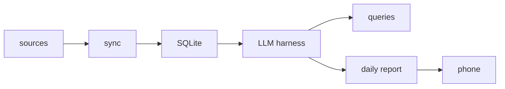

# vPop

**V**alue **P**roductivity **O**ver **P**rivacy.

Instead of asking you to switch to a new productivity tool, this one sits on top of the information channels you already use. You don't need to change anything.

## Overview

Most productivity tools require you to move your life into them. This one goes the other direction: it pulls from the places your information already lives — messages, notes, calendars, email — normalizes it into a local database, and puts an LLM on top of it.

That gives you two things: the ability to ask questions about your own information in plain language, and a daily briefing assembled from everything the system knows about your day.

## Features

**Multi-source ingestion**
Pulls from texts, email, Google Calendar, reminders, notes, and photos of physical journals. Each source lands in a local SQLite database, one table per source.

**Natural-language querying**
An LLM tool harness reads the database with an emphasis on context efficiency and accuracy, so you can ask general questions about your own information instead of searching several apps.

**Daily reports**
A structured rundown of the day: schedule items, plus other relevant context like weather. Generated each morning and delivered to your phone.

**To-do review**
Beyond your schedule, the system looks over your to-do list and surfaces things worth doing today — including the small stuff that tends to fall through: text someone back, charge your AirPods.

**Usable in the car**
Audio output and a single-button trigger to generate a report, so the whole thing works hands-free.

## Architecture

Sync status is tracked in a dashboard showing when each source was last pulled, with syncs triggerable from the dashboard directly. NFC tags are being considered as a way to prompt a sync from a phone.

## Stack

- **Ingestion** — Python. The sync mechanism differs per source, using whatever approach works best for each one, so expect this layer to be somewhat scattered by design.
- **Storage** — SQLite, one table per source.
- **LLM layer** — a skill plus Python scripts that give the model efficient, accurate access to the database.
- **Dashboard** — HTML.

## Roadmap

### v1.0 — Ingestion and querying
- Obsidian notes and text messages as sources
- SQLite storage, one table per source
- Sync-status dashboard with sync triggers
- LLM tool harness for querying the database

### v2.0 — Daily reports
- Morning job runs on laptop, uploads to local server
- Report generated server-side and sent to phone

### v2.1 — More sources, audio out
- WhatsApp and reminders
- Out-loud podcast-style report

### v2.2 — Remaining sources
- Samsung Notes, journal photos, Google Calendar

## Status

Pre-release. v1.0 is in progress; nothing here is stable yet.

## Installation

_Not yet documented._

## Usage

_Not yet documented._

## Privacy

This project deliberately trades privacy for convenience — that tradeoff is the premise, not an oversight. Your messages, notes, and calendar data are aggregated into a single local store and passed to an LLM. Consider carefully where that model runs and what your threat model is before pointing this at your real accounts.

## License

This project is licensed under the Apache License 2.0 — see the [LICENSE](LICENSE) file for details.