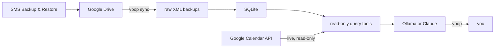

# vPop

**V**alue **P**roductivity **O**ver **P**rivacy.

Instead of asking you to switch to a new productivity tool, this one sits on top of the information channels you already use. You don't need to change anything.

## Overview

Most productivity tools require you to move your life into them. This one goes the other direction: it reads from the places your information already lives — messages, notes, calendars, email — and puts an LLM on top of it. What has an API (Google Calendar) is read live while you ask; what doesn't (phone message backups) is copied into a local database.

That gives you two things: the ability to ask questions about your own information in plain language, and a daily briefing assembled from everything the system knows about your day.

## Features

Pre-release. What works today is marked ✅; everything else is planned (see the roadmap).

- ✅ **Text messages** — SMS, MMS and RCS from Android, via SMS Backup & Restore backups on Google Drive, imported into a local SQLite database.
- ✅ **Natural-language questions** — `vpop` opens a chat in the terminal that puts an LLM (a local Ollama model, or Claude) on top of the database through read-only query tools, so it pulls in only the rows it needs.
- ✅ **Benchmark** — fixed questions over a synthetic database with known answers, for comparing models and settings.
- ✅ **Google Calendar** — read live and read-only through the Calendar API while a question is answered; nothing is stored.
- Other sources — notes, email, reminders, photos of physical journals.
- Daily report — a morning rundown of your schedule and to-dos (text someone back, charge your AirPods), delivered to your phone, with audio output and a single-button trigger for the car.
- Sync dashboard — when each source was last pulled, with sync triggers.

## Architecture


```mermaid
graph LR
    backup["SMS Backup & Restore"] --> drive["Google Drive"]
    drive -->|vpop sync| raw["raw XML backups"]
    raw --> sqlite["SQLite"]
    sqlite --> tools["read-only query tools"]
    calendar["Google Calendar API"] -->|live, read-only| tools
    tools --> llm["Ollama or Claude"]
    llm -->|vpop| you["you"]
```

Sources come in two kinds. A *synced* source (text messages) is copied to disk by `vpop sync`: the downloaded backups are the source of truth, and the database is derived from them and can be rebuilt at any time (`vpop sync --rebuild`). A *live* source (Google Calendar) is read through its API while a question is answered, with a read-only scope, and nothing is stored.

The model never sees the data directly: it calls tools that search messages (full-text and substring), read a conversation around a message, run read-only SQL for counts, and search and read calendar events. Each source contributes its tools and its part of the system prompt, and a source that isn't set up is left out of the conversation with a warning.

Code layout (`src/vpop/`):

- `cli.py` — the `vpop` command
- `config.py`, `paths.py` — settings and every file location
- `db.py` — schema, migrations and connections
- `sources/` — the `Source` interface (`base.py`), the list of sources (`registry.py`), `vpop sync`, and one package per source: `android_messages/` (fetch, parse, store, sync, tools) and `google_calendar/` (API client, tools); `google/` holds the shared Google OAuth and the Drive client
- `assistant/` — the toolbox and `run_sql`, the system prompt, the shared tool loop, the Ollama and Claude harnesses, `vpop auth`
- `ui/` — the chat: rich draws the transcript, prompt_toolkit reads the input
- `benchmark/` — the synthetic fixture, cases, grader and runner

## Roadmap

### v1.0 — Ingestion and querying (in progress)
- ✅ Text messages as a source; Obsidian notes next
- ✅ Google Calendar as a live source
- ✅ SQLite storage
- Sync-status dashboard with sync triggers
- ✅ LLM tool harness for querying the database

### v2.0 — Daily reports
- Morning job runs on laptop, uploads to local server
- Report generated server-side and sent to phone

### v2.1 — More sources, audio out
- WhatsApp and reminders
- Out-loud podcast-style report

### v2.2 — Remaining sources
- Samsung Notes, journal photos

## Installation

Requires Python 3.12+ and [uv](https://docs.astral.sh/uv/).

```sh
git clone https://github.com/marcushadeed/vPop.git && cd vPop
uv tool install .        # puts `vpop` on your PATH (or: uv sync, then `uv run vpop`)
vpop config init         # writes ~/.config/vpop/config.toml with every setting documented
```

### Text message backups

1. On your Android phone, install **SMS Backup & Restore** and schedule a daily backup of messages to **Google Drive**. vPop reads XML backups; media is optional.
2. Open the backup folder in Drive and copy the id from its URL (`https://drive.google.com/drive/folders/<id>`) into the config:
   ```toml
   [android_messages]
   drive_folder_id = "<id>"
   ```
3. Create a Google OAuth client so vPop can read that folder: in [Google Cloud Console](https://console.cloud.google.com/), create a project, enable the **Google Drive API**, then *APIs & Services → Credentials → Create credentials → OAuth client ID → Desktop app*. Download the JSON and save it as `~/.config/vpop/oauth-client-credentials.json`.
4. Run `vpop sync`. The first run opens a browser for consent (read-only Drive access); the token is cached beside the config, readable only by you.

### Google Calendar

The calendar uses the same OAuth client as the message backups.

1. In the same Cloud Console project, enable the **Google Calendar API** (*APIs & Services → Library*). If you skipped the message backups, first create the OAuth client as in step 3 above.
2. Turn it on in the config; optionally leave out calendars by name or id:
   ```toml
   [google_calendar]
   enabled = true
   exclude_calendars = ["Holidays in United States"]
   ```
3. Run `vpop auth google`. It opens a browser once to grant read-only Calendar access (along with Drive, so neither drops the other). `vpop auth status` shows what's granted.

While the OAuth consent screen is in *Testing*, Google expires its tokens after 7 days, and vPop then asks you to run `vpop auth google` again. Publishing the app (*OAuth consent screen → Publish app*) avoids that; for your own account, Google then shows an "unverified app" warning at consent, which you can click through.

### A model

- **Local (default, nothing leaves your machine):** install [Ollama](https://ollama.com/), run `ollama serve`, and pull a model with tool support: `ollama pull qwen3:8b`.
- **Claude:** run `vpop auth login` to save an API key (or log in with the Anthropic CLI), and answer yes when it offers to switch `local_model` off. Message rows the model asks for are then sent to Anthropic.

## Usage

```sh
vpop sync                  # download new backups and import them
vpop sync --offline        # import what's already downloaded, no network
vpop sync --rebuild        # recreate the database from every downloaded backup

vpop                       # chat (the same as `vpop ask`)
vpop ask "Where did Jordan end up moving?"   # one question

vpop config show           # the settings in effect
vpop auth status           # which Anthropic credentials are used and whether they work, and the Google access granted
vpop auth google           # grant read-only Google access for the enabled sources (opens a browser)

vpop bench                                         # benchmark the configured Ollama model
vpop bench --model qwen3:8b --think on --think off
vpop bench --provider claude --effort low --effort medium   # costs API credits
vpop bench --compare FILE1.jsonl FILE2.jsonl
```

`-v` shows debug output and `-q` hides progress. Files live in the XDG directories: settings and secrets in `~/.config/vpop/`, backups, the database, chat history and benchmark results in `~/.local/share/vpop/`.

### The chat

Each tool call the model makes shows as it runs (`● search_messages(text: "moving")`, with a line on what it found), then the answer, rendered as markdown. Claude's answers stream in as they're written; a local model's appear when finished. The footer under the input shows the model and what the conversation has used so far: tokens, and with Claude the estimated cost.

- Enter sends, Alt+Enter adds a line, ↑ and ↓ go through earlier questions.
- Ctrl-C cancels a running question or clears the line; twice on an empty line, it quits. Ctrl-D also quits.
- `/help` lists the keys and commands, `/new` starts a new conversation, `/exit` quits.

When stdin or stdout isn't a terminal, vPop stays plain: `vpop ask "…" > answer.txt` writes just the answer, and questions piped into `vpop` get plain answers.

## Development

```sh
uv sync                      # installs vpop in editable mode plus the dev tools
uv run pytest
uv run ruff check src tests && uv run ruff format src tests
uv run mypy                  # strict, for src/
uv run pylint src && uv run pylint --rcfile tests/pylintrc tests
```

CI runs all of these on every push. Tests never touch your real config or data: each one gets its own temporary home and XDG directories.

Adding a source: subclass `Source` in `sources/base.py` (or `SyncedSource` for one copied to disk), give it a `Toolset` of read-only tools whose docstrings are written for the model and a section of the system prompt, and add it to `SOURCES` in `sources/registry.py`. Prefer reading an API live when there is one; sync only what has no API.

Changing the database schema: add a function to `db.MIGRATIONS` and bump `db.SCHEMA_VERSION`; never edit an existing migration. If a change alters how message ids (hashes) are computed, existing databases can't be migrated, so make `migrate` refuse them and point the user at `vpop sync --rebuild`, which works because the raw backups are kept.

## Privacy

This project deliberately trades privacy for convenience — that tradeoff is the premise, not an oversight. Your messages, notes, and calendar data are gathered in one place and passed to an LLM: with Claude, the message rows and calendar events the model asks for are sent to Anthropic. vPop only ever asks Google for read-only access, so even a model misled by text in an invite or a message can't change your data. Consider carefully where that model runs and what your threat model is before pointing this at your real accounts.

## License

This project is licensed under the Apache License 2.0 — see the [LICENSE](LICENSE) file for details.